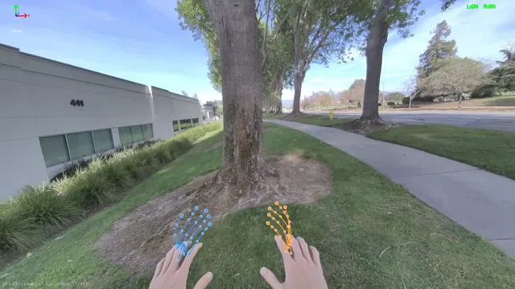

# RecordHuman

A VR app for PICO headsets that records human hand poses through passthrough cameras for robot learning (imitation learning, teleoperation, etc.).

<div align="center">
  
</div>

## Features

- **Passthrough cameras** — see the real world through the headset while recording
- **Hand tracking** — captures 26 joints per hand at configurable framerate (default 30 Hz)
- **Head tracking** — records head position and orientation alongside hand data
- **Screen recording** — simultaneously captures the headset's screen via PICO Enterprise API
- **Controller-driven workflow** — pull trigger to start, squeeze both grips to stop (no need to look at menus while performing tasks)
- **Lightweight JSON output** — easy to parse in Python, convert to LeRobot format, etc.

## Quick Start

### 1. Download the APK

Grab the latest `build.apk` from the [Releases](../../releases) page.

### 2. Install on your PICO headset

Enable **Developer Mode** and **USB Debugging** on the headset, then:

```bash
adb install build.apk
```

### 3. Record

1. Launch the app from the PICO app library
2. You'll see the real world through passthrough with a floating status panel
3. **Pull the right trigger** to start a 5-second countdown (put controllers down during the countdown so hand tracking activates)
4. Perform the task you want to capture
5. **Pick up controllers and squeeze both grips for 1 second** to stop and save

Each recording is saved as a timestamped JSON file on the device.

### 4. Retrieve data

```bash
adb pull /sdcard/Download/RecordHuman/ ./recordings/
```

If the above path is empty, try the fallback location:

```bash
adb pull /storage/emulated/0/Android/data/com.DefaultCompany.VRTemplate/files/recordings/ ./recordings/
```

## Data Format

Each recording is a JSON file named `YYYYMMDD_HHMMSS.json`:

```json
{
  "metadata": {
    "recording_id": "20260223_153000",
    "start_time_utc": "2026-02-23T15:30:00Z",
    "device": "PICO 4",
    "target_fps": 30,
    "total_frames": 900,
    "duration_seconds": 30.0,
    "joint_names": ["Palm", "Wrist", "ThumbMetacarpal", "..."],
    "data_format": "position_xyz_rotation_xyzw"
  },
  "frames": [
    {
      "t": 0.033,
      "head_pos": [x, y, z],
      "head_rot": [qx, qy, qz, qw],
      "left_tracked": true,
      "left_joints": [x, y, z, qx, qy, qz, qw, ...],
      "right_tracked": true,
      "right_joints": [x, y, z, qx, qy, qz, qw, ...]
    }
  ]
}
```

Each hand has **26 joints x 7 floats** (3 position + 4 quaternion) = 182 floats per hand.

**Joint order:** Palm, Wrist, ThumbMetacarpal, ThumbProximal, ThumbDistal, ThumbTip, IndexMetacarpal...IndexTip, MiddleMetacarpal...MiddleTip, RingMetacarpal...RingTip, LittleMetacarpal...LittleTip.

## Loading Data in Python

```python
import json
import numpy as np

with open("recordings/20260223_153000.json") as f:
    data = json.load(f)

for frame in data["frames"]:
    t = frame["t"]
    head_pos = np.array(frame["head_pos"])
    head_rot = np.array(frame["head_rot"])

    if frame["left_tracked"]:
        left = np.array(frame["left_joints"]).reshape(26, 7)
        left_positions = left[:, :3]    # (26, 3)
        left_rotations = left[:, 3:]    # (26, 4) quaternion xyzw

    if frame["right_tracked"]:
        right = np.array(frame["right_joints"]).reshape(26, 7)
        right_positions = right[:, :3]
        right_rotations = right[:, 3:]
```

## Training with OpenTau

To convert data collected by this app into [LeRobot](https://github.com/huggingface/lerobot) format and train vision-language-action (VLA) models, see the **[OpenTau](https://github.com/TensorAuto/OpenTau)** documentation:

- **Repository:** [https://github.com/TensorAuto/OpenTau](https://github.com/TensorAuto/OpenTau)
- **Docs:** [opentau.readthedocs.io](https://opentau.readthedocs.io/)

OpenTau is Tensor’s training toolchain for VLA models and uses LeRobot datasets for training. Use its docs and tooling to turn your RecordHuman JSON recordings into a format suitable for training with VLAs.

## Building from Source

### Requirements

- **Unity** 6000.3.9f1 (Unity 6 LTS) with **Android Build Support** (including Android SDK, NDK, and OpenJDK)
- **PICO Unity Integration SDK** 3.3.3 ([download](https://developer.picoxr.com/resources/#sdk))
- **PICO 4** or **PICO 4 Enterprise** headset

### Setup

1. Clone the repo:

```bash
git clone https://github.com/<your-username>/RecordHuman.git
cd RecordHuman
```

2. Download the **PICO Unity Integration SDK v3.3.3** from the [PICO Developer Portal](https://developer.picoxr.com/resources/#sdk) and extract it.

3. Update the SDK path in `Packages/manifest.json`:

```json
"com.unity.xr.picoxr": "file:/path/to/your/PICO Unity Integration SDK-3.3.3-20251202"
```

4. Open the project in Unity Hub and open `Assets/MainScene.unity`.

5. Verify XR settings under **Edit > Project Settings > XR Plug-in Management** (Android tab): PICO (PXR Loader) should be checked. Under **PXR settings**, Hand Tracking and Video See Through should both be enabled.

6. Connect your PICO headset via USB, then **File > Build Settings > Build And Run**.

## Troubleshooting

**No passthrough / black background:**
- Ensure the Main Camera's clear flags = `Solid Color` with background alpha = `0`
- Verify `videoSeeThrough: 1` in `Assets/Resources/PXR_ProjectSetting.asset`
- Passthrough only works on the physical headset, not in the Unity Editor

**Hand tracking not working:**
- Check **PXR Project Settings > Hand Tracking** is enabled
- Controllers must be set down / out of view for hand tracking to activate
- The `XRInputModalityManager` warning about "Hand Tracking Subsystem not found" is expected in the Editor — it resolves on device

**Checking logs on device:**

```bash
adb logcat -s Unity | grep "DataCollection"
```
